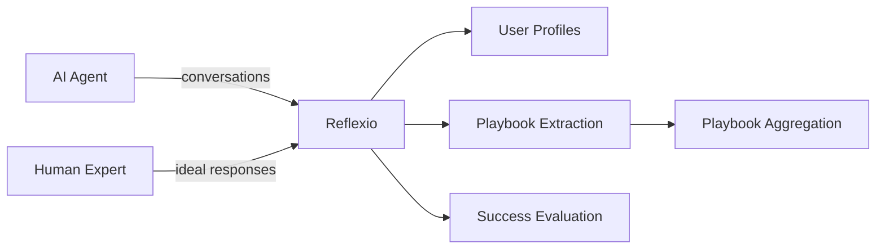

# GitHub Repo Snapshot: `ReflexioAI/reflexio`

## Observation Scope

- Repository: `ReflexioAI/reflexio`
- URL: https://github.com/ReflexioAI/reflexio
- Requested topic: 仓库架构与工程实践
- Observed ref: `main`
- Latest resolved commit: `7df1a50188a241c6fb7d5ac10803646610639f8a`
- Commit date: `2026-04-14T03:12:31Z`
- Snapshot date (UTC): `2026-04-14`

## Repository Metadata

- Description: Make your agents improve themselves. Reflexio is an agent self-improvement platform. It turns every conversation your AI agent has into a learning opportunity
- Default branch: `main`
- Language: `Python`
- Stars: `48`
- Forks: `2`
- Open issues: `1`

## Top-Level Tree

### Directories

- `.claude`
- `client_dist`
- `docs`
- `notebooks`
- `reflexio`
- `scripts`
- `tests`

### Files

- `.env.example`
- `.gitignore`
- `CLAUDE.md`
- `LICENSE`
- `README.md`
- `developer.md`
- `how_to_write_readme.md`
- `pyproject.toml`
- `pyrightconfig.json`
- `run_services.sh`
- `stop_services.sh`
- `uv.lock`

## Selected Evidence Anchors

- `CLAUDE.md`
- `README.md`
- `pyproject.toml`

## Captured Files

### `CLAUDE.md`

- Source path: `CLAUDE.md`
- Truncated: `no`

```md
# Reflexio

See [developer.md](developer.md) for full development guidelines, project structure, and setup instructions.

## Quick Reference

- Start services: `./run_services.sh` — runs FastAPI backend (port 8081) and Next.js docs (port 3000)
- Run commands in uv env: `uv run <cmd>` or activate `.venv`
- Use `curl` for API testing (faster); use Chrome for frontend tasks
- Never change env variable values in `.env` file — use shell exports for overrides
- API schemas live in `reflexio/models/api_schema/`
```

### `README.md`

- Source path: `README.md`
- Truncated: `no`

```md
<p align="center">
  <a href="https://github.com/reflexio-ai/reflexio">
    
  </a>
</p>
<div align="center">

[](https://www.python.org/)
[](LICENSE)
[](https://pypi.org/project/reflexio-client/)
[](reflexio/benchmarks/retrieval_latency/results/report.md)

[Quick Start](#quick-start) · [Features](#features) · [SDK](#sdk-usage) · [CLI](reflexio/cli/README.md) · [Architecture](#architecture) · [Docs](https://www.reflexio.ai/docs) · [Contributing](#contributing)

</div>

---

## What is Reflexio?
The moat for AI agents isn't the model — it's what your agent learns from every interaction it handles.

Reflexio is a **self-improvement platform** for AI agents. It turns every conversation your AI agent has into a learning opportunity — automatically extracting user preferences and behavioral playbooks so your agent continuously improves itself without manual tuning.



Publish conversations from your agent, and Reflexio closes the self-improvement loop:

- **Never Repeat the Same Mistake**: Transforms user corrections and interaction signals into improved decision-making processes — so agents adapt their behavior and avoid repeating the same mistakes.
- **Lock In What Works**: Persists successful strategies and workflows so your agent reuses proven paths instead of starting from scratch.
- **Correct in Real Time**: Retrieves personalization and operational signals to fix agent behavior live — no retraining required.
- **Learn from Human Experts**: Publish expert-provided ideal responses alongside agent responses — Reflexio automatically extracts actionable playbooks from the differences.
- **Personal & Global Improvements**: Separates individual user preferences from system-wide agent improvements.
- **AI First Self-Optimization**: Agents autonomously reflect, learn, and improve — less human-in-the-loop, more compounding gains.

> **For developers**: See [developer.md](developer.md) for project structure, environment setup, testing, and coding guidelines.

## Demo

<p align="center">
  
</p>

## Quick Start

### Prerequisites

| Tool | Description |
| --- | --- |
| [uv](https://docs.astral.sh/uv/getting-started/installation/) | Python package manager |
| [Node.js](https://nodejs.org/) >= 18 | Frontend runtime |

<p align="center">
  
</p>

### Setup

```shell
# 1. Clone and configure
git clone https://github.com/reflexio-ai/reflexio.git
cd reflexio
cp .env.example .env          # Set at least one LLM API key (OpenAI, Anthropic, etc.)

# 2. Install dependencies
uv sync                                   # Python (includes workspace packages)
npm --prefix docs install                  # API docs

# 3. Start services (--storage sqlite is the default)
uv run reflexio services start                    # API (8081), Docs (8082), SQLite storage
uv run reflexio services stop                     # Stop all services
```

> Alternative: `python -m reflexio.cli services start` or `./run_services.sh`

Once running, open **[http://localhost:8082](http://localhost:8082)** to interactively browse and try out the API.
<p align="center">
  
</p>

### Try it in 30 seconds (CLI)

Reflexio ships a first-class CLI — the fastest way to see the loop end-to-end with no code. Publish a real multi-turn conversation where the user **corrects** the agent (that's the signal Reflexio learns from), then search for what was extracted:

```shell
uv run reflexio publish --user-id alice --wait --data '{
  "interactions": [
    {"role": "user",      "content": "Deploy the new service."},
    {"role": "assistant", "content": "Starting deployment to us-east-1..."},
    {"role": "user",      "content": "Wait — we never deploy production to us-east-1. Always use us-west-2."},
    {"role": "assistant", "content": "Understood. Switching to us-west-2."}
  ]
}'

# Search the extracted profiles and playbooks
uv run reflexio search "deployment region"
```

One conversation, two artifacts: a user profile (`production region is us-west-2`) and an agent playbook (`confirm region before deploying`). See the [CLI reference](reflexio/cli/README.md) for all input modes (inline JSON, `--file`, `--stdin`) and the full command list.

### Integrate with the Python SDK

```python
import reflexio

client = reflexio.ReflexioClient(
    url_endpoint="http://localhost:8081/"
)

# Publish a multi-turn conversation where the user corrects the agent —
# Reflexio extracts a profile ("prod region = us-west-2") and a playbook
# ("confirm region before deploying").
client.publish_interaction(
    request_id="req-001",
    user_id="alice",
    interactions=[
        reflexio.Interaction(role="user",      content="Deploy the new service."),
        reflexio.Interaction(role="assistant", content="Starting deployment to us-east-1..."),
        reflexio.Interaction(role="user",      content="Wait — we never deploy production to us-east-1. Always use us-west-2."),
        reflexio.Interaction(role="assistant", content="Understood. Switching to us-west-2."),
    ],
)
```

Reflexio will automatically generate profiles and extract playbooks in the background.

## Features

### Profile Generation

- Extracts behavioral profiles from conversations using configurable extractors
- Supports versioning (current → pending → archived) with upgrade/downgrade workflows
- Multiple extractors run in parallel with independent windows and strides

[Read more about user profiles →](https://www.reflexio.ai/docs/concepts/user-profiles)

### Playbook Extraction & Aggregation

- Extracts playbooks from user behavior patterns
- Clusters similar entries and aggregates with LLM (with change detection to skip unchanged clusters)
- Approval workflow: review and approve/reject agent playbooks

[Read more about agent playbooks →](https://www.reflexio.ai/docs/concepts/agent-playbook)

### Expert Learning

- Publish human-expert ideal responses alongside agent responses via the `expert_content` field
- Reflexio automatically compares agent vs. expert responses, focusing on substantive differences (missing info, incorrect approach, reasoning gaps) while ignoring stylistic ones
- Generates actionable playbooks as trigger/instruction/pitfall SOPs that teach the agent what to do differently

[Read more about interactions & expert content →](https://www.reflexio.ai/docs/concepts/interactions#5-expert-content-for-learning-from-experts)

### Agent Success Evaluation

- Session-level evaluation triggered automatically (10 min after last request)
- Shadow comparison mode: A/B test regular vs shadow agent responses
- Tool usage analysis for blocking issue detection

[Read more about evaluation →](https://www.reflexio.ai/docs/examples/agent-evaluation)

### Search & Retrieval

- Hybrid search (vector + full-text) across profiles and playbooks
- LLM-powered query rewriting for improved recall
- Unified search across all entity types in parallel
- **Fast at scale**: unified search across ~3,000 indexed rows (profile + user playbook + agent playbook, ~1,000 rows each, queried in parallel) runs at **~57 ms p50 / ~73 ms p95** — measured service-layer with local SQLite on an Apple Silicon MacBook, 30 trials × 20 fixed queries. See the [full benchmark report](reflexio/benchmarks/retrieval_latency/results/report.md) or reproduce with [`reflexio.benchmarks.retrieval_latency`](reflexio/benchmarks/retrieval_latency/README.md).

### Multi-Provider LLM Support

- OpenAI, Anthropic, Google Gemini, OpenRouter, Azure, MiniMax, and custom endpoints
- Powered by LiteLLM — configure your preferred provider via API keys or custom endpoints

## SDK Usage

For detailed API documentation, see the [full API reference](https://www.reflexio.ai/docs/api-reference).

Install the client:

```shell
pip install reflexio-client
```

### Basic usage

```python
import reflexio

client = reflexio.ReflexioClient(
    url_endpoint="http://localhost:8081/"
)

# Publish interactions
await client.publish_interaction(
    request_id="req-001",
    user_id="user-123",
    interactions=[...],
    agent_version="v1",       # optional: track agent versions
    session_id="session-abc", # optional: group requests into sessions
)

# Search profiles
profiles = await client.search_profiles(
    reflexio.SearchUserProfileRequest(query="deployment region preference")
)

# Search agent playbooks
playbooks = await client.get_agent_playbooks(
    reflexio.GetAgentPlaybooksRequest(agent_version="v1")
)
```

### Configuration

```python
# Update org configuration
await client.set_config(reflexio.SetConfigRequest(
    config=reflexio.Config(
        api_key_config=reflexio.APIKeyConfig(openai="sk-..."),
        profile_extractor_configs=[...],
        playbook_configs=[reflexio.PlaybookConfig(...)],
    )
))
```

## Architecture

```
Client (SDK / Web UI)
  → FastAPI Backend
    → Reflexio Orchestrator
      → GenerationService
        ├─ ProfileGenerationService  → Extractor(s) → Deduplicator → Storage
        ├─ PlaybookGenerationService → Extractor(s) → Deduplicator → Storage
        └─ GroupEvaluationScheduler  → Evaluator(s) → Storage (deferred 10 min)
```

See [developer.md](developer.md) for project structure, supported LLM providers, and development setup.

## Documentation

For comprehensive guides, examples, and API reference, visit the **[Reflexio Documentation](https://www.reflexio.ai/docs)**.

## Contributing

We welcome contributions! Please see [developer.md](developer.md) for guidelines.

## License

This project is currently licensed under [Apache License 2.0](LICENSE).
```

### `pyproject.toml`

- Source path: `pyproject.toml`
- Truncated: `no`

```toml
[project]
name = "reflexio-ai"
version = "0.2.9"
description = "A Python library for the Reflexio"
authors = [{name = "Reflexio Team"}]
readme = "README.md"
license = "Apache-2.0"
requires-python = ">=3.12"
dependencies = [
    # Client deps (lightweight)
    "pydantic>=2.0.0",
    "requests>=2.25.0",
    "aiohttp>=3.11.12",
    "python-dateutil>=2.8.0",
    "python-dotenv>=1.1.0",
    "pyyaml>=6.0",
    # Server deps
    "fastapi>=0.111.1",
    "uvicorn>=0.34.0",
    "openai>=2.8.0",
    "anthropic>=0.72.0",
    "litellm>=1.80.11",
    "braintrust>=0.12.0",
    "python-jose>=3.3.0",
    "passlib>=1.7.4",
    "tenacity>=9.0.0",
    "bcrypt>=4.2.1",
    "duckduckgo-search>=7.0.1",
    "xlsxwriter>=3.2.2",
    "hdbscan>=0.8.40",
    "redis>=6.2.0",
    "websocket-client>=1.8.0",
    "tiktoken>=0.12.0",
    "slowapi>=0.1.9",
    "cachetools>=6.2.4",
    "colorlog>=6.10.1",
    "httpx>=0.28.1",
    "pydantic[email]>=2.12.5",
    "nltk>=3.9.3",
    # CLI
    "typer>=0.15.0",
    "rich>=13.0.0",
]

[project.optional-dependencies]
vec = ["sqlite-vec>=0.1.6"]
notebooks = ["pandas>=3.0.2"]

[dependency-groups]
dev = [
    "pre-commit>=4.0.1",
    "pytest>=8.3.4",
    "pytest-asyncio>=0.25.0",
    "pytest-xdist>=3.8.0",
    "pytest-timeout>=2.3.1",
    "black>=24.10.0",
    "moto>=5.0.28",
    "jupyterlab>=4.4.3",
    "matplotlib>=3.10.8",
    "ruff>=0.15.0",
    "pyright>=1.1.400",
    "pytest-cov>=6.0",
    "syrupy>=5.0",
    "mutmut>=3.2.0",
    "commitizen>=4.1.0",
    "python-semantic-release>=10.0.0",
    "build>=1.0.0",
    "twine>=6.0.0",
]
docs = [
    "mkdocs>=1.5.3",
    "mkdocs-material>=9.5.3",
    "mkdocstrings[python]>=0.24.0",
    "griffe>=0.38.0",
    "mkdocstrings-python>=1.7.0",
]

[project.scripts]
reflexio = "reflexio.cli.__main__:main"

[build-system]
requires = ["hatchling"]
build-backend = "hatchling.build"

# sdist: explicitly list what goes in. Without this, hatchling's default
# file walker follows the `client_dist/reflexio` symlink (which points to
# `../reflexio`), caches the resolved paths, and then skips the real
# top-level `reflexio/` directory as already-seen — producing an sdist
# (and wheel-from-sdist) missing the entire package.
[tool.hatch.build.targets.sdist]
only-include = [
    "reflexio",
    "pyproject.toml",
    "README.md",
    "LICENSE",
    ".env.example",
]

[tool.hatch.build.targets.wheel]
packages = ["reflexio"]

[tool.hatch.build.targets.wheel.force-include]
".env.example" = "reflexio/data/.env.example"

[tool.pytest.ini_options]
# Parallel test execution with pytest-xdist
# -n auto: Use all available CPU cores
# --dist worksteal: Dynamic load balancing — idle workers steal from busy workers' queues
addopts = "-n auto --dist worksteal --cov --cov-report=term-missing --cov-report=html --timeout=120"
testpaths = ["tests"]
asyncio_default_fixture_loop_scope = "function"
markers = [
    "unit: Fast isolated tests with all dependencies mocked",
    "integration: Tests with real storage but mocked LLM",
    "e2e: Full workflow tests with real storage and services",
    "requires_credentials: Tests that need API keys (costs money)",
]

[tool.coverage.run]
# Measure branch coverage — ensures both if/else paths are tested, not just lines
branch = true
source = ["reflexio"]
omit = [
    "**/__init__.py",
    "tests/*",
    "reflexio/data/*",
    "*/conftest.py",
    "reflexio/scripts/*",
    "reflexio/reflexio_commons/*",
    "reflexio/server/services/email/templates/*",
]

[tool.coverage.report]
show_missing = true
skip_covered = true
skip_empty = true
fail_under = 65
exclude_lines = [
    "pragma: no cover",
    "if TYPE_CHECKING:",
    "if __name__ == .__main__.:",
    "@overload",
]

[tool.coverage.html]
directory = "htmlcov"

[tool.ruff]
target-version = "py312"
line-length = 88

[tool.ruff.lint]
select = [
    "E",      # pycodestyle errors
    "F",      # pyflakes (unused imports, undefined names)
    "W",      # pycodestyle warnings
    "B",      # flake8-bugbear (likely bugs & design problems)
    "UP",     # pyupgrade (modern Python syntax)
    "I",      # isort (import sorting)
    "C4",     # flake8-comprehensions (correct dict/list/set usage)
    "SIM",    # flake8-simplify (code simplification patterns)
    "RET",    # flake8-return (return statement quality)
    "PERF",   # perflint (performance anti-patterns)
    "C90",    # McCabe complexity
    "S",      # flake8-bandit (security checks)
    "N",      # pep8-naming conventions
    "ANN",    # flake8-annotations (enforce type annotations)
    "ARG",    # flake8-unused-arguments
    "G",      # flake8-logging-format (no f-strings in logging)
    "PTH",    # flake8-use-pathlib (pathlib over os.path)
    "FURB",   # refurb (modern Python idioms)
    "FLY",    # flynt (string join → f-string)
    "PLR1714",# pylint: repeated-equality-comparison → use `in`
    "PLR1716",# pylint: boolean-chained-comparison → chain
]
ignore = [
    "E501",   # line too long (handled by formatter/black)
    "E402",   # module-level import not at top (common in __init__.py)
    "ANN002",  # missing type for *args (often inherited from frameworks)
    "ANN003",  # missing type for **kwargs (often inherited from frameworks)
    "ANN204",  # missing return type for __init__ (-> None is obvious)
    "ANN401",  # dynamically typed Any (sometimes intentional)
]

[tool.ruff.lint.per-file-ignores]
"__init__.py" = ["F401", "F403"]
"tests/**" = ["S101", "ARG001", "ARG002", "PTH", "ANN", "S105", "S106", "S107", "S108"]
"conftest.py" = ["ARG001"]
"notebooks/**" = ["S101", "F821", "S105", "S106", "ANN", "PTH", "RET504", "S113", "ARG001"]
"reflexio/scripts/**" = ["S101", "G004", "ANN"]
"reflexio/benchmarks/**" = ["S311"]
"reflexio/server/api.py" = ["B008", "ARG001", "ARG002"]
"reflexio/server/api_endpoints/**" = ["B008", "ARG001", "ARG002"]
"reflexio/integrations/**" = ["ARG002"]
"reflexio/server/services/configurator/test_config_storage.py" = ["S101", "ANN", "S108"]
"demo/**" = ["S101", "PTH", "G004", "ANN"]
"reflexio/server/services/storage/sqlite_storage/**" = ["S608"]
"reflexio/cli/**" = ["S603", "S607", "S104"]

[tool.ruff.lint.mccabe]
max-complexity = 20

[tool.ruff.format]
quote-style = "double"
indent-style = "space"

[tool.mutmut]
paths_to_mutate = [
    "reflexio/server/services/service_utils.py",
    "reflexio/server/services/deduplication_utils.py",
    "reflexio/server/services/feedback/feedback_service_utils.py",
    "reflexio/server/services/storage/storage_base/_base.py",
]
tests_dir = "tests/"
runner = "python -m pytest -x -q -o 'addopts='"

[tool.commitizen]
name = "cz_conventional_commits"
version_provider = "pep621"
tag_format = "reflexio-v$version"
update_changelog_on_bump = false

[tool.semantic_release]
version_toml = ["pyproject.toml:project.version"]
tag_format = "reflexio-v{version}"
commit_message = "chore(release): reflexio v{version}"
build_command = "pip install build && python -m build"

[tool.semantic_release.branches.main]
match = "^(main|master)$"
prerelease = false

[tool.semantic_release.changelog]
exclude_commit_patterns = ["^chore\\(release\\)"]

[tool.semantic_release.remote]
type = "github"
token = { env = "GH_TOKEN" }
```

### `developer.md` (Selected)

- Source path: `developer.md`
- Truncated: `yes` (first 100 lines)

```md
# Developer Guide

## Project Structure

```
reflexio/
├── reflexio/              # Main Python package
│   ├── client/            # ReflexioClient implementation
│   ├── cli/               # Command-line interface
│   ├── data/              # Data storage / fixtures
│   ├── integrations/      # LLM and external integrations
│   ├── lib/               # Core library functions
│   ├── models/            # Data models and API schemas
│   │   └── api_schema/    # API request/response schemas
│   ├── server/            # FastAPI backend
│   │   ├── api_endpoints/ # Route handlers
│   │   ├── services/      # Business logic and storage
│   │   ├── llm/           # LLM provider integration
│   │   ├── prompt/        # Prompt templates
│   │   └── site_var/      # Site configuration
│   └── test_support/      # Testing utilities
├── docs/                  # Next.js 16 docs frontend (ShadCN UI)
├── tests/                 # Test suite (pytest)
├── scripts/               # Utility scripts (e.g. reset_db.py)
├── client_dist/           # Lightweight client distribution package
└── notebooks/             # Jupyter notebooks (examples, quickstart)
```

## Services

Two services, started together via `./run_services.sh`:

| Service | Framework | Default Port | Env Var |
|---------|-----------|-------------|---------|
| Backend | FastAPI (uvicorn) | 8081 | `BACKEND_PORT` |
| Docs | Next.js 16 | 8082 | `DOCS_PORT` |

`API_BACKEND_URL` is derived automatically as `http://localhost:${BACKEND_PORT}`.

**Storage backend** — pass `--storage sqlite` (default) or `--storage supabase` to select the data storage backend:
```bash
uv run reflexio services start --storage sqlite    # local SQLite (default)
uv run reflexio services start --storage supabase  # Supabase PostgreSQL
```
...
```

### `reflexio/server/OVERVIEW.md`

- Source path: `reflexio/server/OVERVIEW.md`
- Truncated: `no`

```md
# Reflexio
Description: Enable AI agent to self-improve through user interactions

## Main Components

| Directory | Description | Details |
|-----------|-------------|---------|
| `src/server/` | FastAPI backend - processes interactions, generates profiles, extracts playbooks | [README](src/server/README.md) |
| `src/reflexio_lib/` | Core library - `Reflexio` orchestrator connecting API to services | `reflexio_lib.py` |
| `src/reflexio_client/` | Python SDK for interacting with Reflexio API | [README](src/README.md) |
| `src/reflexio_commons/` | Shared schemas and configuration models | [README](src/README.md) |
| `src/website/` | Next.js frontend - profiles, interactions, playbooks, evaluations, account, auth UI | `app/`, `components/` |
| `demo/` | Conversation simulation demo - scenarios, simulator, and live viewer | [README](demo/readme.md) |
| `docs/` | API reference documentation site (Next.js) | `app/`, `components/`, `lib/` |

## Architecture

```
Client (SDK/Web)
  -> FastAPI (server/api.py)
    -> get_reflexio() (server/cache/)
      -> Reflexio (reflexio_lib/)
        -> GenerationService (server/services/)
          ├─> ProfileGenerationService -> ProfileExtractor(s) -> Storage
          ├─> PlaybookGenerationService -> PlaybookExtractor(s) -> Storage
          └─> GroupEvaluationScheduler (deferred 10 min) -> Evaluator(s) -> Storage
```
```

### `reflexio/lib/reflexio_lib.py`

- Source path: `reflexio/lib/reflexio_lib.py`
- Truncated: `no`

```python
"""Reflexio facade — assembled from domain mixins."""

from reflexio.lib._agent_playbook import AgentPlaybookMixin
from reflexio.lib._config import ConfigMixin
from reflexio.lib._dashboard import DashboardMixin
from reflexio.lib._generation import GenerationMixin
from reflexio.lib._interactions import InteractionsMixin
from reflexio.lib._operations import OperationsMixin
from reflexio.lib._profiles import ProfilesMixin
from reflexio.lib._search import SearchMixin
from reflexio.lib._user_playbook import UserPlaybookMixin


class Reflexio(
    InteractionsMixin,
    ProfilesMixin,
    AgentPlaybookMixin,
    UserPlaybookMixin,
    ConfigMixin,
    GenerationMixin,
    OperationsMixin,
    DashboardMixin,
    SearchMixin,
):
    """Synchronous facade providing a unified API for all Reflexio operations."""
```

### `reflexio/server/services/generation_service.py` (Selected)

- Source path: `reflexio/server/services/generation_service.py`
- Truncated: `yes` (first 100 lines)

```python
import logging
import uuid
from collections.abc import Callable
from concurrent.futures import ThreadPoolExecutor
from concurrent.futures import TimeoutError as FuturesTimeoutError
from dataclasses import dataclass, field
from datetime import UTC, datetime

from reflexio.defaults import resolve_agent_version
from reflexio.models.api_schema.service_schemas import (
    Interaction,
    PublishUserInteractionRequest,
    Request,
)
from reflexio.server.api_endpoints.request_context import RequestContext
from reflexio.server.llm.litellm_client import LiteLLMClient
from reflexio.server.services.agent_success_evaluation.delayed_group_evaluator import (
    GroupEvaluationScheduler,
)
...

@dataclass
class GenerationServiceResult:
    """Result of a GenerationService.run call.

    Exposes the internally generated request_id plus any warnings so callers
    (CLI, API) can report back to users where their publish landed.
    """
    request_id: str | None = None
    warnings: list[str] = field(default_factory=list)


class GenerationService:
    """
    Main service for orchestrating profile, playbook, and agent success evaluation generation.

    This service coordinates multiple generation services (profile, playbook, agent success)
    and manages the overall interaction processing workflow.
    """
```

### `reflexio/server/services/profile/profile_generation_service.py` (Selected)

- Source path: `reflexio/server/services/profile/profile_generation_service.py`
- Truncated: `yes` (first 80 lines)

```python
"""Service to generate user profiles from interactions"""

import logging
import uuid
from dataclasses import dataclass, field
from datetime import UTC, datetime
from typing import TYPE_CHECKING, Any

if TYPE_CHECKING:
    from reflexio.server.api_endpoints.request_context import RequestContext
    from reflexio.server.llm.litellm_client import LiteLLMClient

from reflexio.models.api_schema.internal_schema import RequestInteractionDataModel
from reflexio.models.api_schema.service_schemas import (
    DeleteUserProfileRequest,
    DowngradeProfilesResponse,
    ManualProfileGenerationRequest,
    ManualProfileGenerationResponse,
    ProfileChangeLog,
    RerunProfileGenerationRequest,
    RerunProfileGenerationResponse,
    Status,
    UpgradeProfilesResponse,
    UserProfile,
)
...

@dataclass
class ProfileGenerationServiceConfig:
    """Runtime configuration for profile generation service shared across all extractors."""
    user_id: str
    request_id: str
    source: str | None = None
    existing_data: Any = None
    allow_manual_trigger: bool = False
    output_pending_status: bool = False
    extractor_names: list[str] | None = None
    rerun_start_time: int | None = None
    rerun_end_time: int | None = None
    auto_run: bool = True
    force_extraction: bool = False
    is_incremental: bool = False
    previously_extracted: list[list[UserProfile]] = field(default_factory=list)


class ProfileGenerationService(
    BaseGenerationService[
        ProfileExtractorConfig,
        ProfileExtractor,
        ProfileGenerationServiceConfig,
        ProfileGenerationRequest,
...
```

### `reflexio/server/services/playbook/playbook_generation_service.py` (Selected)

- Source path: `reflexio/server/services/playbook/playbook_generation_service.py`
- Truncated: `yes` (first 80 lines)

```python
import logging
import uuid
from dataclasses import dataclass, field
from typing import TYPE_CHECKING

if TYPE_CHECKING:
    from reflexio.server.api_endpoints.request_context import RequestContext
    from reflexio.server.llm.litellm_client import LiteLLMClient

from reflexio.models.api_schema.internal_schema import RequestInteractionDataModel
from reflexio.models.api_schema.service_schemas import (
    DowngradeUserPlaybooksResponse,
    ManualPlaybookGenerationRequest,
    ManualPlaybookGenerationResponse,
    RerunPlaybookGenerationRequest,
    RerunPlaybookGenerationResponse,
    Status,
    UpgradeUserPlaybooksResponse,
    UserPlaybook,
)
...

@dataclass
class PlaybookGenerationServiceConfig:
    """Runtime configuration for playbook generation service shared across all extractors."""
    request_id: str
    agent_version: str
    user_id: str | None = None
    source: str | None = None
    allow_manual_trigger: bool = False
    rerun_start_time: int | None = None
    rerun_end_time: int | None = None
    auto_run: bool = True
    force_extraction: bool = False
    extractor_names: list[str] | None = None
    is_incremental: bool = False
    previously_extracted: list[list[UserPlaybook]] = field(default_factory=list)


class PlaybookGenerationService(
    BaseGenerationService[
        PlaybookConfig,
        PlaybookExtractor,
        PlaybookGenerationServiceConfig,
        PlaybookGenerationRequest,
...
```

## Directory Tree Summary

### `reflexio/` (Main Package)

```
reflexio/
├── README.md
├── __init__.py
├── benchmarks/          # 性能基准测试
├── cli/                 # 命令行接口
│   ├── README.md
│   ├── __init__.py
│   ├── __main__.py
│   ├── _client.py
│   ├── app.py
│   ├── bootstrap_config.py
│   ├── commands/
│   ├── env_loader.py
│   ├── errors.py
│   ├── log_format.py
│   ├── output.py
│   ├── run_services.py
│   ├── state.py
│   ├── stop_services.py
│   └── utils.py
├── client/              # ReflexioClient
│   ├── __init__.py
│   └── client.py
├── defaults.py
├── integrations/        # 外部集成
├── lib/                 # 核心库（Mixin 门面）
│   ├── __init__.py
│   ├── _agent_playbook.py
│   ├── _base.py
│   ├── _config.py
│   ├── _dashboard.py
│   ├── _generation.py
│   ├── _interactions.py
│   ├── _operations.py
│   ├── _profiles.py
│   ├── _search.py
│   ├── _storage_labels.py
│   ├── _user_playbook.py
│   └── reflexio_lib.py
├── models/              # 数据模型
│   ├── __init__.py
│   ├── api_schema/
│   │   ├── __init__.py
│   │   ├── common.py
│   │   ├── domain/
│   │   ├── internal_schema.py
│   │   ├── retriever_schema.py
│   │   ├── service_schemas.py
│   │   ├── ui/
│   │   └── validators.py
│   ├── config_schema.py
│   └── py.typed
├── server/              # FastAPI 后端
│   ├── OVERVIEW.md
│   ├── README.md
│   ├── __init__.py
│   ├── api.py
│   ├── api_endpoints/
│   │   ├── account_api.py
│   │   ├── precondition_checks.py
│   │   ├── publisher_api.py
│   │   ├── request_context.py
│   │   └── retriever_api.py
│   ├── cache/
│   ├── llm/             # LiteLLM 客户端
│   ├── prompt/          # Prompt 模板
│   ├── services/
│   │   ├── agent_success_evaluation/
│   │   │   ├── agent_success_evaluation_constants.py
│   │   │   ├── agent_success_evaluation_service.py
│   │   │   ├── agent_success_evaluation_utils.py
│   │   │   ├── agent_success_evaluator.py
│   │   │   ├── delayed_group_evaluator.py
│   │   │   └── group_evaluation_runner.py
│   │   ├── base_generation_service.py
│   │   ├── configurator/
│   │   ├── deduplication_utils.py
│   │   ├── extractor_config_utils.py
│   │   ├── extractor_interaction_utils.py
│   │   ├── generation_service.py
│   │   ├── operation_state_utils.py
│   │   ├── playbook/
│   │   │   ├── README.md
│   │   │   ├── playbook_aggregator.py
│   │   │   ├── playbook_deduplicator.py
│   │   │   ├── playbook_extractor.py
│   │   │   ├── playbook_generation_service.py
│   │   │   ├── playbook_service_constants.py
│   │   │   └── playbook_service_utils.py
│   │   ├── pre_retrieval/
│   │   ├── profile/
│   │   │   ├── profile_deduplicator.py
│   │   │   ├── profile_extractor.py
│   │   │   ├── profile_generation_service.py
│   │   │   └── profile_generation_service_utils.py
│   │   ├── storage/
│   │   │   ├── constants.py
│   │   │   ├── disk_storage/
│   │   │   ├── error.py
│   │   │   ├── sqlite_storage/
│   │   │   └── storage_base/
│   │   ├── unified_search_service.py
│   │   └── service_utils.py
│   └── site_var/        # 站点配置
└── test_support/        # 测试工具
```

### `tests/` (Test Suite)

```
tests/
├── __init__.py
├── benchmarks/
├── cli/
├── client/
├── conftest.py
├── e2e_tests/
├── fixtures/
├── lib/
├── models/
├── server/
├── test_data/
├── test_scripts/
├── utils/
```
