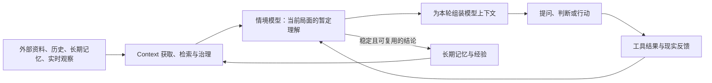

# 情境模型在 Context Engineering 中的位置

> 状态：探索性工作假设，尚未证明是一个独立概念。若把 memory 广义理解为模型外部、能够跨调用保留并重新注入的状态，那么所谓“情境模型”至多是 `task-scoped working memory` 的一种结构，与 `task state`、`belief state`、结构化任务简报和动态澄清策略高度重叠。本文后半部分保留的是待验证构想，不是既成的系统架构。

## 摘要

截至 2026-07，`context engineering` 已经不再只是写 prompt，而是在 Agent 运行过程中持续决定：模型此刻应获得什么信息、工具和状态，这些内容如何被检索、压缩、持久化、隔离、纠正与评测。

本文曾把“情境模型”暂定义为：

> Agent 对当前任务局面的显式、暂定、可更新表示。它依据已经观察到的证据，保留仍然存在的不确定性，并且足以支持下一次提问、判断或行动。

但截至目前，没有证据证明这需要成为一个独立对象。上述作用也可能完全由已有的任务状态、belief state、结构化摘要和提问策略承担。因此，更准确的研究问题不是“情境模型怎样实现”，而是“把 Agent 的当前理解显式维护为一个独立对象，是否产生已有方法没有的可观察增量”。

这轮讨论进一步把问题收束到更基础的位置：即使它只是 task memory，真正困难的也不是表示和存储，而是**如何获得足以支持当前行动的 task memory**。

## 它是否具有独立概念资格

一个新概念不能仅凭定义与其他概念不同而成立。它至少要同时经受三项检验：现有对象无法解释某类稳定失败；引入它会导致不同的实现选择；它能事先给出可证伪的结果预测。

“情境模型”目前没有通过这些检验。此前的论述主要描述了它应该包含什么、放在哪一层、由谁维护，却没有证明：同一个 Agent 使用普通 `task state` 或结构化简报时做不到什么。随着追问深入，它的位置也不断从 context 管理移动到认知状态、runtime 和文件系统，说明我们更可能是在为一组已有机制寻找总称，而不是发现了新的技术对象。

因此当前应采用删除测试：在模型、工具和可用证据相同的条件下，去掉名为“情境模型”的独立状态，只保留普通任务状态与一个动态澄清策略。如果效果没有显著下降，这个概念就是冗余的。

真正值得先验证的机制可以不使用这个名词：

> Agent 在行动前，指出最可能改变下一步的一个未确认假设；用户或证据纠正后，相关建议必须随之改变。

这首先是一种决策前的动态澄清与纠错机制，而不必是一种新模型。只有实验反复表明，必须跨轮维护一个独立、可检查的状态对象，才能稳定实现这种纠错，“情境模型”才获得独立存在的理由。

即使这个对象确有用，它也不必成为 memory 之外的新系统。从基础设施看，它就是一段任务作用域的 memory：在任务中频繁更新，可以跨轮恢复，任务结束后归档或失效。与长期 memory 的差异不只在更新频率，还在有效范围和真值语义：前者表达“当前任务暂时怎样”，后者保存“未来任务仍可能有用的过去”。但这些差异只要求 memory 系统支持不同的作用域、写入门槛和失效规则，不足以证明存在一个新的概念层。

以下章节保留此前构想，用于说明若该假设成立，它可能怎样被实现和评测；不应把它们读作当前领域已有的标准分层。

## 真正的问题：task memory 如何获得

鸭哥的 `context-infrastructure` 所解决的核心问题之一，正是如何从历史经历中获得长期 memory。它不把 memory 当作用户手工填写的档案，而是让 observer 持续读取日常痕迹形成 observations，再由 reflector 从重复信号中蒸馏出更稳定的判断。它的关键机制发生在写入之前：哪些经历值得观察，哪些观察值得保留，哪些重复信号可以晋升。

task memory 面临同构但更实时的问题。当前任务真正关键的信息往往既不在长期 memory 里，也没有被用户完整说出。系统如果只总结对话，只能保存已经出现的信息，无法获得用户尚未表达的约束、判断依据和局面变化。

但不能因此推导出“Agent 应该识别用户缺少的关键事实”。如果目标是人的 `unknown known`，在它显现之前，Agent 和人都无法把它准确命名。它不是一个已经存在于外部、等待 Agent 检索的字段，而是人的经验性判断在遇到具体方案、冲突或选择时才会表现出来。

因此，task memory 的获得更像诱发而不是发现。Agent 可以根据现有材料生成一个具体方案、一组有实质差异的选择，或一个可逆试探。人的接受、迟疑、否定和修正使原本隐性的判断第一次变成可观察证据。Agent能选择和调整刺激，但不能声称自己事先知道被诱发出来的内容。

```text
已有 context
    ↓
生成具体方案 / 对照 / 试探
    ↓
人的反应、选择或纠正
    ↓
隐性判断首次显现
    ↓
经人确认的内容写入 task memory
    ↓
下一次方案或行动
```

两套机制的差异可以压缩成一句话：长期 memory 主要从已经发生的历史中蒸馏；这里的 task memory 则通过人对具体刺激的反应在任务进行中共同生成。前者观察已有痕迹，后者设计能让新痕迹出现的互动。

由此，AI 谋士更值得验证的产品假设不再是“维护一个情境模型”，而是：

> 系统能否提供比开放式追问更有区分度的具体刺激，使人以较低负担显露原本没有表达、甚至尚未意识到的判断，并把这次显露可靠地带入后续行动。

这也改变了写入边界。Agent 生成的猜测和方案只是探针，不能直接成为 canonical task memory；只有人的明确表达、选择、纠正或可观察行为，才构成可写入证据。如果系统只是换一种方式让用户填写背景表，或者产生大量无关追问，它并没有让 unknown known 显现。

### 不是靠持续答错

人的纠正确实可以暴露隐性判断，但“持续输出错误答案”不是方法本身。随机错误不会稳定触发有价值的认识，只会把生成和质检负担转移给用户，并快速消耗信任。

真正需要的是一个足够具体、接近可用、且容易局部修改的候选结果。它可以是正确答案，也可以是不完全正确的近似；价值来自它把原本模糊的可能空间压缩成了人能够判断的对象。核心标准是：

```text
纠正候选结果的认知成本
        <
用户从零表达同一判断的认知成本
```

同时，这次纠正必须真实改变后续结果，并在相似任务中减少重复纠正。否则系统只是通过犯错向用户征收反馈，而没有获得可复用的 task memory。

因此，实验不应奖励“成功诱发了多少纠正”，而应检查：候选结果是否帮助人表达了原本难以表达的判断；纠正成本是否低于从零说明；同类错误是否随后减少。错误只是可能出现的副产物，不是产品应该主动最大化的变量。

### Frictionless interaction 对上述方法的进一步否定

即使纠正候选结果比从零表达更容易，只要用户需要专门停下当前工作、阅读 AI 方案并承担校准责任，它仍然不是 frictionless。上一节的成本比较只是必要条件，不是充分条件；它仍可能把“训练系统”包装成较轻的审稿任务。

真正低摩擦的 task memory 只能是主要工作的副产品。系统观察用户本来就会产生的选择、修改、跳过、撤销、交付结果和后续行动，从中形成低置信度观察；或者，AI 对话本身就是用户正在完成的真实思考工作，而不是为了收集 memory 额外安排的访谈。用户不应为了让系统更懂自己而增加一条独立任务。

这暴露出一个无法用交互设计绕过的约束：

```text
不接触用户的真实工作过程
+ 不要求用户显式说明或纠正
+ 仍要获得用户未表达的 unknown known
= 不可能同时成立
```

因此产品至少要放弃一个前提：要么获得对真实工作痕迹的适度观察能力；要么只在对话本身已经具有即时工作价值的场景里运行；要么承认只能使用已有 context 和长期 memory，无法可靠获得新的 unknown known。

这也重新定义了产品价值顺序：系统必须先凭已有信息对当前工作产生即时价值，然后才有资格从自然使用痕迹中学习。不能先要求用户提供反馈，承诺以后会更懂他。如果 AI 谋士既不进入真实工作面，又不能让对话本身成为高价值工作，它的隐性知识获取假设就不成立。

## 从零定义情境模型

Agent 不能直接接触完整现实。它只会收到不完整的用户表达、文件、历史记录、工具结果和环境反馈。它必须据此形成一份关于“现在发生了什么”的暂定理解，才能决定下一步。

这份理解如果只存在于单次模型调用的隐含推理中，就无法稳定延续，也很难被外部检查。情境模型把它变成显式工作状态：当前认为哪些判断成立，依据是什么，哪里仍不确定，以及一项关键理解改变后，后续决策将怎样改变。

因此，情境模型的正确性不是“描述得足够完整”，而是“对当前决策足够充分”。与当前决定无关的信息不应进入；足以使建议发生反转的信息不能遗漏。

可以把它的运行关系写成：

```text
历史与当前证据 -> 情境模型 M(t) -> 提问 / 判断 / 行动
                         ^                 |
                         |------ 新观察 ---|
```

情境模型随新证据更新。稳定且跨任务复现的结论可以进入长期 memory；只对本次任务成立的理解应随任务结束而归档或失效。

## Context Engineering 的当前边界

Anthropic 把 context engineering 定义为在推理期间策划和维护最优 token 集合，并强调 Agent 的完整 context state 已经包括指令、工具、MCP、外部数据和消息历史。它的工程重点是有限注意力预算下的高信号选择，以及 just-in-time retrieval、compaction、结构化笔记和子 Agent 隔离。

2025 年的综述把这个领域概括为对 LLM 信息载荷的系统优化，并将基础过程归纳为 context 的获取或生成、处理与管理，再由 RAG、memory、工具推理和多 Agent 系统组合实现。

工程框架正在把这个边界继续向运行时扩展。LangChain 明确区分模型调用看到的 transient context、可被工具和生命周期钩子修改的 persistent context，以及 state、store、runtime configuration 等来源。OpenAI Agents SDK 也把 LLM 可见的 conversation context、应用代码持有的 local context、可恢复的 session 与 run state 分开。

这些框架已经表明，context engineering 的对象不是一个 prompt，而是贯穿 Agent 生命周期的信息环境。但它们主要解决“信息和状态如何进入、保存和流转”，并不自动保证系统形成了正确的局面理解。

## 情境模型在完整体系中的位置



在这张图里，Context Engine 负责寻找、筛选和治理可能相关的材料；情境模型负责把材料组织成当前局面的解释；context assembly 再从情境模型、证据和工具说明中选择本轮模型真正需要看到的内容；policy 或 Agent loop 据此采取行动。

因此，情境模型不是一种新的 context，也不是 memory 的新分支。它属于 Agent 的状态估计或认知建模层，只是在工程实现中需要由 context 系统提供证据、保存状态并将其重新注入模型。它回答的不是“模型此刻可以访问什么”，而是“基于现有证据，系统此刻认为现实处于什么状态”。

## 为什么此前会误以为它与 Memory 不在同一层

此前的区分隐含采用了狭义定义：把 `Memory` 限定成“跨任务仍然有用的过去”，于是把当前任务理解排除在 memory 之外。这种定义适合区分产品功能，却不适合判断基础设施类别。

若按广义工程定义，memory 是模型调用之外能够保存、更新和重新取回的状态，那么 session state、task state、working memory 与长期用户记忆都属于 memory 的不同生命周期。所谓情境模型即使存在，也只是其中一类经过解释和结构化的 task memory。

```text
长期 memory 与当前观察提供证据
              ↓
task memory 保存当前暂定理解
              ↓
policy 选择下一步
```

这里仍然可以区分“保存了什么”与“怎样使用它”：task memory 保存当前状态，policy 据此选择下一步。但这是 memory representation 与 action policy 的区别，不足以把前者升级成 memory 之外的独立基础设施。

## 情境模型应该发生在哪里

如果实验需要显式维护这个对象，它直接复用 memory / state infrastructure，不另建一层。它的更新控制与物理存储可以由不同部件承担：

```text
LLM 根据证据提出模型更新
        ↓
Harness 校验并应用 patch，拥有当前版本
        ↓
文件或数据库保存 canonical state 与历史版本
        ↓
Context assembler 为下一次模型调用生成必要投影
```

模型权重适合承载通用的局面理解能力和先验知识，不适合承载某个具体任务正在变化的情境模型。权重不可被用户直接检查，更新速度与任务变化不匹配，也无法清楚记录某项判断来自哪条证据。微调可以提升“怎样构造情境模型”的能力，但不应成为任务情境状态的 source of truth。

这段 task memory 的生命周期所有者应该是 Agent Harness 或 runtime。Harness 决定何时允许更新、谁的纠正优先、当前版本是什么，以及任务结束时归档还是失效。LLM 是更新提议者，不应既生成推断又无条件把推断认定为事实。

持久化应发生在模型之外。实验可以使用现有 task state、一个 Markdown / JSON 文件，或数据库中的 task-memory record。选择依据是能否查看、编辑、diff 和恢复，而不是是否建立了名为“情境模型”的新存储系统。

模型窗口只应接收情境模型在本轮任务中的必要投影。完整模型、历史版本和证据链继续留在外部状态中，按需读取。这样既避免每轮重新推断全部局面，也避免把完整状态持续塞进 context 导致污染。

因此，最小实现只是：LLM 提议修改，Harness 管理 task-memory 生命周期，既有文件或数据库负责保存和回查。

## 与现有对象的边界

`Memory` 保存过去值得跨任务复用的内容；情境模型维护当前任务中仍会变化的理解。`Session state` 记录本轮发生过什么；情境模型进一步解释这些事件对当前局面意味着什么。`Plan` 描述准备怎样行动；情境模型是生成和修订计划的依据。`Context packet` 是某次模型调用实际收到的信息；情境模型可以被压缩进 packet，但自身可以持续存在于窗口之外。

它也不等于 chain-of-thought。推理痕迹服务一次模型计算，未必稳定、可信或适合展示。情境模型应该只保存后续决策真正依赖、能够被证据支持和外部纠正的工作判断。

## 与 belief state 和 world-state understanding 的关系

在部分可观察环境中，经典 Agent 理论用 `belief state` 表示基于历史观察和行动推断出的可能世界状态。2026 年的 Agent-BRACE 把 belief model 与 action policy 分开，用带不确定性标记的自然语言判断压缩长历史，再让 policy 基于这一状态行动。这与情境模型非常接近：两者都不把完整历史直接等同于当前状态，也都要求显式保存不确定性。

但本文所说的情境模型比环境 belief state 略宽。人在知识工作中不仅需要判断外部世界怎样，还要解释当前问题是什么、什么结果才算成功，以及用户和其他参与者怎样理解局面。这些内容有时不是客观世界状态，而是共同形成的任务解释。

Task2Quiz 的结果进一步说明了这个缺口：Agent 完成任务，并不代表它获得了可迁移的环境理解；现有 memory 机制也未必能建立 grounded world model。因此，情境模型不能只通过最终任务成功率评价，还应直接检查系统对当前局面的理解是否准确、是否知道自己不确定在哪里，以及纠正后行动是否相应变化。

## 当前成熟度判断

“情境模型”目前不是 context engineering 领域公认的标准组件名称。主流工程系统已有许多近似载体，例如 graph state、session state、structured notes、task summary 和 run state；研究侧则正在重新发展 belief-state representation 与 world-state understanding。

真正尚未成熟的部分，是把这些能力统一成一个面向通用知识工作的对象：它既能从多种 context 来源形成，又能显式区分证据与推断；既能在 Agent loop 内部驱动行动，又能让用户直接检查和修正；一处前提变化后，还能追踪哪些下游判断需要失效。

因此，更稳妥的定位不是宣称发现了一个全新领域，而是：

> “情境模型”是对一种 task-scoped memory representation 的暂定称呼。真正需要验证的是显式维护当前理解能否改善行动，而不是它是否值得成为新概念。

## 最小可行情境模型：决策敏感情境建模

第一版不需要建立完整用户模型、组织模型或世界模型。它只需要围绕一个即将发生的判断，维护足以决定下一步的最小理解。

这套方法可以压缩成一句话：

> 先确定当前要做的决定，再找出最可能使这个决定反转的未确认理解，用最低成本验证它，然后让修正真实传导到下一步。

情境模型的基本单位不是一个背景字段，而是一条“决策敏感判断”：系统暂时相信什么，依据是什么，以及它如果错误会改变哪项行动。没有下游影响的信息，不进入最小模型。

### 一张最小情境卡

```markdown
# Situation v1

当前决定：现在需要决定什么？

当前理解：基于现有证据，我认为局面是怎样的？

关键前提：哪一项尚未确认的理解，最可能改变下一步？

反转条件：如果它不成立，建议将从什么改为什么？

下一步：现在应该验证这个前提，还是已经可以行动？
```

这张卡不承担完整记录功能。证据仍保存在原始对话、文件和工具 trace 中，情境卡只保留当前行动真正依赖的理解，并通过链接或引用指回证据。

### “下一步”的定义

在 Agent 工作中，“下一步”不是计划表中的下一条，也不必等于一次模型调用或一次工具调用。它是：

> Agent 根据当前情境模型，已经有足够理由立即承诺的最小语义完整状态转换。执行结束后，必须产生一个可观察的新状态，使 Agent 可以重新判断。

它在 loop 中的位置是：

```text
情境模型 M(t) -> 下一步 a(t) -> 新观察 o(t+1) -> 情境模型 M(t+1)
```

“最小”不是把动作拆成尽可能细的机械操作，而是不要跨过本应重新观察和判断的节点。为了确认某个判断而连续读取几个文件，可以共同构成一个下一步；“完成整个产品”则不是，因为执行过程中会出现大量足以改变路径的新证据。

“语义完整”意味着 Agent 已经不需要在执行过程中偷偷补做新的方向判断。动作开始前，其目的、允许范围和预期观察已经清楚。如果仍缺少一个会改变行动方向的判断，那么真正的下一步应当是先获取那项信息，而不是开始执行更大的任务。

下一步最终只产生三种实质结果：减少关键不确定性、改变任务或外部环境的状态，或者确认当前应当停止、阻塞或转交。停止并不是“没有下一步”，而是 Agent 根据情境模型选择的一个终止状态。

一个动作是否构成有效下一步，可以用执行后的检查点判断：系统能否明确说出发生了什么变化、获得了什么新证据，以及这是否要求更新当前情境模型。如果做完后没有新状态可观察，它通常只是内部计算片段，不是 Agent loop 中有意义的步。

### 最小运行闭环

第一步不是收集背景，而是确定“当前决定”。如果无法说清下一步究竟要决定什么，系统应先帮助用户收束问题，而不是开始扩充 context。

随后，系统用一句话写出当前理解，并从中找出一个最关键的未确认前提。所谓关键，是它一旦被否定，下一步会发生明显变化。第一版最多保留三项，默认只处理影响最大的一项。

系统接着选择验证成本最低的动作：可以向用户问一个问题、读取一份证据，也可以执行一个可逆的小探针。选择依据不是“还能了解什么”，而是“哪种新信息最可能改变当前决定”。

得到新证据后，系统更新情境卡，并明确展示：哪项理解改变了，原先依赖它的哪些建议因此失效，新建议是什么。如果重要前提被修正而行动没有变化，系统必须解释为什么；否则这项前提原本就不应被称为关键。

当剩余不确定性已经不足以改变眼前下一步时，系统停止追问并行动。行动结果成为新观察，进入下一版情境卡。只有跨任务反复出现、经过验证的稳定结论，才另行提议写入长期 memory。

### 最小实现

第一版只需要一个随任务保存的 Markdown 或 JSON 文件，以及两次模型调用：一次根据当前证据生成或更新情境卡，一次读取情境卡后提出问题或选择行动。每当用户纠正、工具返回关键结果或行动失败时，重新运行更新步骤。

不需要先建设知识图谱、向量数据库或复杂依赖图。为了验证“修正是否传导”，只需为每一项关键前提记录它当前影响的建议，并在更新后生成一段简短 diff。

### 最小评测

首轮只看三个结果：系统提出的问题中，有多少答案真正改变了下一步；关键前提被纠正后，相关建议是否全部同步更新；相比直接把完整历史交给同一模型，这种情境卡是否在更少交互成本下提高了决策适配度。

其中最关键的不是任务成功率，而是“反转预测”是否成立：系统事先声称某项前提会改变决策，当用户纠正它时，后续行动是否真的按预期变化。这能直接区分情境模型和普通摘要。

## 评测方向

情境模型不能只用 retrieval recall 或任务完成率评测。更直接的实验是固定主模型、工具和证据，比较完整历史、普通摘要与显式情境模型三种条件。评测系统是否识别关键状态，是否保留重要不确定性，是否因错误前提采取错误行动，以及收到纠正后能否撤销受影响的判断。

任务结果仍然重要，但它应与模型自身的状态理解分开测量。否则系统可能偶然完成任务，却没有形成可迁移、可校准的局面理解。

## 来源依据

- [Anthropic: Effective context engineering for AI agents](https://www.anthropic.com/engineering/effective-context-engineering-for-ai-agents)
- [A Survey of Context Engineering for Large Language Models](https://arxiv.org/abs/2507.13334)
- [LangChain: Context engineering in agents](https://docs.langchain.com/oss/python/langchain/context-engineering)
- [OpenAI Agents SDK: Context management](https://openai.github.io/openai-agents-python/context/)
- [Agent-BRACE: Decoupling Beliefs from Actions in Long-Horizon Tasks](https://arxiv.org/abs/2605.11436)
- [Task2Quiz: What Do LLM Agents Know About Their World?](https://arxiv.org/abs/2601.09503)
- [Memory for Autonomous LLM Agents](https://arxiv.org/abs/2603.07670)

## 相关页面

- [Context Engine：上下文编排层](context-engine.md)
- [Agent Context Infra 前沿调研（2026-05-25）](agent-context-infra-2026-05-25.md)
- [长期 file-based context engine 设计](file-based-context-engine-design.md)
- [知识系统判断框架](../../frameworks/知识系统判断框架.md)
